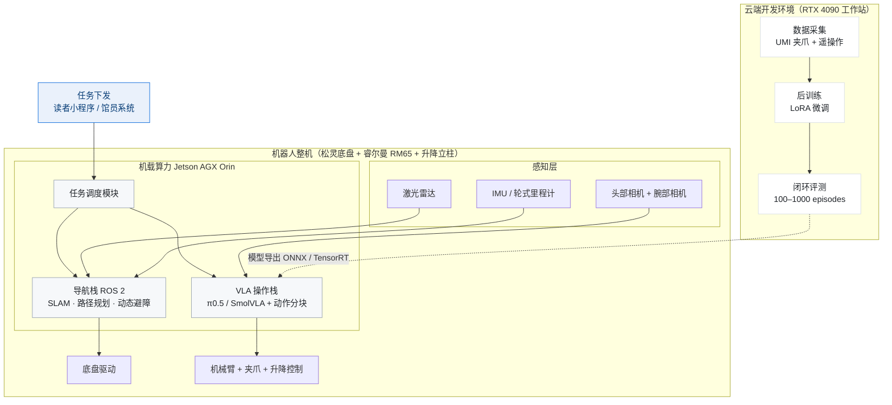

# 图书馆机器人 VLA 算法技术落地可行性报告
## 已知条件与算法目标

**硬件接口**

+ 整机：供应链提供
+ 动作空间：末端位姿 / 关节角，ROS 2 接口开放，可加装算力模组
+ 观测：头部相机 + 腕部相机 + 激光雷达 + IMU / 轮式里程计

**数据条件**

+ 公司主业为数据标注，采集、清洗、标注自有产能
+ 采用 UMI 手持夹爪范式采集，成本约遥操作 1/10、速度 5×

**算法栈**

+ 开源 VLA 模型可选：SmolVLA（450M, Apache 2.0）、π0.5（3.3B, Apache 2.0 骨干 Gemma 条款）、GR00T N1.7（3B, Apache 2.0 明确商用）
+ 训练框架：LeRobot（Apache 2.0），官方后训练脚本
+ 推理门槛：RTX 4090（24GB）可训练 SmolVLA；π0.5 LoRA 需 22.5GB 显存起步

**算法目标**

训练一版图书馆取放书场景的 VLA 模型，使机器人基于视觉观测 + 语言指令自主完成「导航到架 → 抓取图书 → 插入书位」的操作决策。核心指标：固定书架取放成功率 ≥85%（快速落地版）→ 开放书架 ≥95%（升级优化版）。

---

## 一、算法问题定义
### 1.1 任务边界
VLA 只负责「手」的操作决策——即书架前的抓取与放置动作生成。导航、调度、对话采用成熟技术栈，通过 ROS 2 解耦。本报告聚焦 VLA 操作栈的训练与部署。

**VLA 输入输出**

+ 输入：头部/腕部相机图像 + 机器人本体状态（关节角 / 位姿）+ 任务语言指令（如"把这本书放到第 3 排第 5 本位置"）
+ 输出：末端位姿动作序列（action chunk，一次预测 10–20 步，覆盖 50Hz 控制周期）

**任务分工**

| 任务 | VLA 承担 | 说明 |
| --- | :---: | --- |
| 还书上架 | ✓ | 从还书箱抓取 → 按索书号导航至书架 → 插入指定层位 |
| 按号取书 | ✓ | 到指定书位取出图书送至取书台 |
| 错架巡检 | ✗ | 视觉 OCR + 导航，非 VLA |
| 读者引导 | ✗ | 对话模型 + 导航，非 VLA |

### 1.2 性能约束
| 指标 | 快速落地版 | 升级优化版 |
| --- | --- | --- |
| 取放成功率 | ≥85%（固定书架） | ≥95%（开放书架） |
| 单任务周期 | ≤120 s | ≤90 s |
| 推理频率 | ≥5 Hz（抓放可容忍 200–500ms 延迟） | 同左，action chunking 覆盖 50Hz 控制 |
| 部署算力 | Jetson AGX Orin | Jetson AGX Thor / Orin |

> 图书 0.3–2kg、开本 32 开 / 16 开；书架 0.3–2.2m（升降立柱覆盖）。这些是训练数据分布需覆盖的物理约束。
>

---

## 二、候选算法选型
### 2.1 选型原则
+ **License 干净**：优先 Apache 2.0 明确商用授权，规避 Gemma / Llama 附加条款的法务成本；
+ **推理硬件可及**：消费级 GPU / Jetson 可实时推理；
+ **后训练生态成熟**：有官方微调脚本与文档，小数据（数百条轨迹）即可适配；
+ **动作空间对接友好**：关节 / 末端位姿接口开放可对接。

### 2.2 候选模型对比
**表 1 · 候选开源 VLA 模型对比（数据来源见文末 Sources）**

| 模型 | 参数量 | 商用 License | 推理硬件门槛 | RTX 4090 频率 | 微调门槛 | 生态工具 |
| --- | --- | --- | --- | --- | --- | --- |
| SmolVLA | 450M | Apache 2.0 | 消费级 GPU / Orin 量化 | 约 20+ Hz | 低（消费级硬件） | LeRobot 官方脚本 |
| π0 / π0.5（openpi） | 3.3B | Apache 2.0（骨干 Gemma 条款） | 8GB+ 显存起 | 约 8–12 Hz | LoRA 22.5GB 显存起 | openpi 全链路最全 |
| GR00T N1.7 | 3B | Apache 2.0 明确商用 | Jetson Thor 机载 | 未公布 | 单卡 48GB 显存 | Isaac 端到端工具链 |
| RDT2 | 7B | 开源（以仓库为准） | 未官方公布 | — | Post 版未放出 | 论文级代码 |
| OpenVLA | 7B | 权重 Llama 2 条款 | 8-bit 约 10GB | 约 3–6 Hz | LoRA 教程成熟 | Notebook 生态 |

**图 1 · 候选模型推理频率对比（第三方实测口径，取中值）**

> _柱状图，数据见表 1。来源：RoboticsCenter AI 第三方对比（非官方 benchmark），实际数值随动作块长度与量化精度变化。_
>

> **结论：** SmolVLA 在两类硬件上均满足图书馆操作任务对控制频率的需求（抓放类任务可容忍 200–500 ms 延迟，对应 2–5 Hz 即可）；π0/π0.5 经 action chunking 后同样可机载；OpenVLA 频率偏低，仅作为学术基线跟踪。
>

### 2.3 选型结论：双模型策略
**算法路线：快速落地用 SmolVLA，升级优化提 π0.5，全程参考 GR00T N1.7 工具链**

+ **快速落地·SmolVLA**：450M 轻量模型，消费级硬件约 20 Hz 推理，Apache 2.0 条款干净；配合 LeRobot 官方训练脚本，**6 个月内完成「数据采集 → 后训练 → 真机验证」的最小闭环**，试错成本最低。
+ **升级优化·π0.5**：3.3B 主力模型：VLM 骨干 + flow matching 动作专家是当前业界事实标准架构，开放世界泛化能力显著优于小模型；LoRA 微调 22.5GB 显存起步（RTX 4090 24GB 可承担）；Jetson AGX Thor 量化部署约 18–20 Hz。商用前完成 Gemma 条款法务核对。
+ **工程参考·GR00T N1.7**：不作为直接训练对象（面向人形本体、post-training 需 48GB 显存），但其**数据格式（LeRobot）、后训练流程、ONNX/TensorRT 导出、LEAPP 机载部署方案**是最佳工程范本，全流程照搬其方法论。
+ **技术跟踪**：RDT2（UMI 数据范式，采集成本 1/10）、StellaVLA（免微调测试时适应）、IMLE-VLA / Jetson-PI（推理加速 3.67× / 8.66×）——作为升级优化版与远期储备。

**演示视频 · SmolVLA 算法操作闭环**

基于 LeRobot + SmolVLA（450M）的模仿学习操作演示，展示 VLA 模型在视觉观测下自主完成抓取—放置动作，对应快速落地版选型的算法可行性验证。

📎 **附件**：[SmolVLA 演示视频（assets/smolvla_demo.mp4）](assets/smolvla_demo.mp4)

> **参考价值：** 该 Demo 对应快速落地版选型——450M 轻量模型在消费级 GPU 上可跑通验证。
>

---

## 三、算法系统架构
架构原则：**VLA 只负责「手」的操作决策**，导航、调度、对话用成熟栈，通过 ROS 2 解耦集成，降低整体风险。

**图 2 · 系统架构：机载运行时（左）与云端训练闭环（右）**

> _实线为运行时数据流，虚线为模型迭代链路；导航栈与 VLA 操作栈在机载 Jetson 上并行运行。_
>

> **设计要点：** 整机到货后仅需打通「Jetson ↔ 底盘/机械臂驱动」的 ROS 2 接口层，VLA 输出末端位姿动作块由驱动层执行；模型迭代在云端完成，经量化导出后热更新到机载端，数据闭环不中断机器人运行。
>

---

## 四、数据与训练方案
### 4.1 数据采集
+ **UMI 手持夹爪**：成本约遥操作 1/10、速度 5×，采集人类操作轨迹，不依赖整机到位（可先行启动）
+ **遥操作双轨**：补充精细操作与边缘场景
+ **目标规模**：快速落地版 400 条轨迹（UMI 200 + 遥操作 200），升级优化版扩至 2000+（多馆书架差异覆盖）
+ **格式**：统一 LeRobot 格式，与 SmolVLA / π0.5 训练脚本对齐
+ **清洗与标注**：公司现有数据团队执行；失败案例定向补数据以「天」级响应

### 4.2 后训练流程（对标 GR00T N1.7 官方流程）
1. **SmolVLA 全流程跑通**：LeRobot 官方脚本，冻结 VLM 骨干只训练动作专家（flow matching），单卡 RTX 4090 可承担（峰值 10–16GB 显存，BS=8）
2. **π0.5 LoRA 微调**：22.5GB 显存起步，RTX 4090 24GB 卡线够用；gradient_checkpointing + bfloat16 降显存
3. **对比实验**：成功率 / 频率 / 泛化三维评估，确定升级优化版主力模型

### 4.3 闭环评测
+ 仿真 + 真机各 100 episodes
+ 覆盖：光照变化、图书开本差异、遮挡场景
+ 失败案例定向补数据（自有标注产能「天」级响应，无外包排期）

### 4.4 部署
+ ONNX 导出 + INT8 量化到 Jetson AGX Orin
+ 动作分块（action chunking，一次预测 10–20 步）覆盖 50Hz 控制周期
+ 模型热更新：云端迭代 → 量化导出 → 机载热加载，不中断运行

---

## 五、分阶段落地计划
### 5.1 快速落地版（2026-10 — 2027-03）
**目标**：单台原型机在真实书架完成「导航到架 → 取放书 → 返回」全流程闭环，固定书架成功率 ≥85%，周期 ≤120s，输出可复现的技术报告与数据集。

**里程碑**

| 节点 | 时间 | 交付物 / 验收标准 |
| --- | --- | --- |
| M1 | 2026-10 | ROS 2 环境打通；底盘与机械臂遥控联调 |
| M2 | 2026-11 | SLAM 建图与书架点位标定；导航栈连续避障运行 |
| M3 | 2026-12 | 数据集 v0.1：UMI 200 + 遥操作 200 条轨迹（LeRobot 格式） |
| M4 | 2027-01 | SmolVLA 后训练完成；固定书架成功率 ≥70%（阶段值） |
| M5 | 2027-02 | π0.5 LoRA 对比报告（成功率/频率/泛化三维评估），确定升级版主力 |
| M6 | 2027-03 | 验收：全流程闭环 ≥85%；技术报告 + 数据集 + 升级方案细化 |

### 5.2 升级优化版（2027-04 — 2028-03）
**目标**：3 台产品机部署 1–2 个真实图书馆，开放书架成功率 ≥95%、周期 ≤90s、连续运行 ≥4h + 自动回充；建立远程运维与数据回流体系，形成可复制部署 SOP。

**工作流**

1. **模型升级**：以快速落地版胜出模型为基础扩量微调（数据扩至 2000+ 轨迹，多馆书架差异覆盖）
2. **鲁棒性专项**：动态读者避让、书架拥挤插入、光照剧变场景的失败案例分析与定向补数据
3. **试点部署**：与图书馆签试点协议，错峰运行（早班前集中上架 + 日间巡检）
4. **运维平台**：任务看板、异常告警、OTA 模型热更新、运行日志审计
5. **安全合规**：急停 / 人工接管机制、限速策略、安全评估报告

**交付物**

+ 图书馆操作数据集 v2.0（2000+ 轨迹，具备对外授权潜力）
+ 运维平台 v1.0 + 部署 SOP + 安全评估报告
+ 试点运营报告（成功率、周期、故障率、人机协作数据）

### 5.3 未来规划（2028 及以后）
**技术演进跟踪**

| 方向 | 代表工作 | 引入时机与价值 |
| --- | --- | --- |
| 免微调适应 | StellaVLA（VLA-Arena 榜首 0.63） | 新馆部署免重训，一条结构化演示即可适配，2027 评估引入 |
| 推理加速 | IMLE-VLA（55 Hz）、Jetson-PI（8.66×） | 机载频率不足或任务复杂度上升时按需引入 |
| 零样本泛化 | RDT2（4U 零样本跨本体） | 若 Post 版开源且硬件门槛下降，可跳过逐馆微调 |
| 在线强化学习 | VLA-Precision（98.3%）、π*0.6 RECAP | 从试点运行数据持续提升成功率 |

**场景扩展**：同一算法底座迁移至档案馆密集架、书店退货整理、仓储轻量拣选——操作模型可迁移，仅数据与工装适配。

---

## 六、软件算法预算
> 仅训练算力与软件工具，不含整机 / 机载硬件 / 数据采集硬件 / 人力成本。工具链以开源（LeRobot / openpi，Apache 2.0）为主，零许可费。
>

**表 2 · 快速落地版（软件算法）**

| 项目 | 明细 | 金额（万元） |
| --- | --- | ---: |
| 训练算力 | RTX 4090 工作站 1 台 + 云端按需租用（SmolVLA 峰值 10–16GB 显存，单卡够用） | 7 |
| 数据与评测工具 | LeRobot 数据集管理、仿真评测环境搭建（开源为主，少量存储与管理成本） | 1 |
| **合计** |  | **8** |

**表 3 · 升级优化版（软件算法）**

| 项目 | 明细 | 金额（万元） |
| --- | --- | ---: |
| 训练算力 | RTX 4090 扩 1 台 + π0.5 LoRA 按需云租（22.5GB 显存，4090 24GB 卡线够用） | 16 |
| 数据与评测工具 | 数据生产管理、闭环评测扩充 | 2 |
| **合计** |  | **18** |

> 软件算法两阶段合计 **26 万元**。训练算力为主体；数据清洗标注由公司自有产能消化，零外包成本。相比外包标注路径（同等规模数据服务估算 40–60 万元），自有产能是结构性成本优势。
>

---

## 七、风险与对策
| 风险 | 等级 | 影响 | 对策 |
| --- | --- | --- | --- |
| 零样本成功率不足 | 高 | 开源模型直接部署成功率低（如 OpenVLA 零样本 48–62%）低于商业标准 | 立项即按「后训练 + 数据闭环」路线，不赌零样本；400 条轨迹起步，失败案例定向补数据——自有标注产能「天」级响应 |
| License 合规 | 中 | π0.5 骨干受 Gemma 条款约束，商用有法务成本 | 主力模型均 Apache 2.0（SmolVLA / GR00T N1.7）；π0.5 商用化前完成法务核对，必要时切换 GR00T 路线 |
| 机载推理延迟 | 中 | 频率不足导致动作「走走停停」 | 动作分块（一次预测 10–20 步）覆盖控制周期；Jetson-PI / IMLE-VLA 加速方案为储备 |
| 场景复杂度超分布 | 中 | 书架拥挤、读者干扰、光照变化超训练分布 | 快速落地版固定书架验证，升级优化版逐步开放；错峰运行；StellaVLA 式测试时适应作为升级路径 |
| 数据分布偏移 | 中 | 新馆书架差异超训练分布 | 升级版扩量采集多馆差异；StellaVLA 免微调适应路径 |

---

## 八、结论
技术拐点已至，算法路线务实可控：

+ 开源 VLA 商用授权（GR00T N1.7 Apache 2.0）、数据成本（UMI 范式 1/10）、机载算力（Jetson 加速方案）三大拐点齐备；
+ 快速落地版用 SmolVLA（450M）跑通最小闭环，消费级 RTX 4090 可训练，软件预算 8 万；
+ 升级优化版提 π0.5（3.3B）提升泛化与上限，软件预算 18 万；
+ 数据飞轮是核心竞争力：公司自有标注产能使补数据「天」级响应，外部团队依赖外包（成本更高、周期不可控），是难以复制的护城河。

**近期行动**：① 启动 SmolVLA + LeRobot 训练环境搭建；② UMI 手持采集先行启动（不依赖整机到位）；③ 招募 / 指定算法 1 人负责训练闭环。

---

## Sources
1. [NVIDIA Isaac GR00T 技术博客（2026-07-07）](https://developer.nvidia.com/blog/develop-humanoid-robot-policies-end-to-end-with-nvidia-isaac-gr00t) — GR00T N1.7 Apache 2.0 商用授权与端到端工作流
2. [NVIDIA Isaac GR00T 代码仓库](https://github.com/NVIDIA-ISAAC-GR00T/Isaac-GR00T) — GitHub
3. [GR00T-N1.7-3B 权重](https://huggingface.co/nvidia/GR00T-N1.7-3B) — Hugging Face
4. [GR00T E2E Workflow 前置条件](https://docs.nvidia.com/learning/physical-ai/gr00t-e2e-workflow/latest/getting-started/prerequisites.html) — NVIDIA 文档（48GB 显存门槛）
5. [openpi 仓库（π0/π0.5）](https://github.com/Physical-Intelligence/openpi) — GitHub
6. [openpi 官方文档](https://www.openpi.net/english.html) — 推理 8GB+ / LoRA 22.5GB / 全量 70GB 显存门槛
7. [openpi on Jetson AGX Thor 部署教程](https://www.jetson-ai-lab.com/tutorials/openpi_on_thor/) — Jetson AI Lab（π0.5 量化 18–20 Hz）
8. [SmolVLA 项目页](https://smolvla.net/) — HuggingFace（450M，消费级约 20 Hz）
9. [LeRobot 仓库](https://github.com/huggingface/lerobot) — GitHub（Apache 2.0）
10. [RDT2 项目页](https://rdt-robotics.github.io/rdt2/) — UMI 数据范式、零样本跨本体、RVQ + flow matching 三阶段训练
11. [RDT2 论文](https://arxiv.org/abs/2602.03310) — arXiv:2602.03310
12. [StellaVLA 论文](https://arxiv.org/abs/2608.11671) — arXiv:2608.11671（VLA-Arena 榜首 0.63）
13. [IMLE-VLA 论文](https://arxiv.org/abs/2609.10915) — arXiv:2609.10915（55 Hz，IROS 2026）
14. [Jetson-PI 论文](https://arxiv.org/abs/2607.12659) — arXiv:2607.12659（CoRL 2026，机载加速 8.66×）
15. [VLA-Precision 论文](https://arxiv.org/abs/2609.04355) — arXiv:2609.04355（在线 RL，98.3%）
16. [Figure AI 官网：F.03 at BMW](https://www.figure.ai/news/f-03-at-bmw) — 商业落地实证
17. [Zero-Shot vs Few-Shot Robot Policies](https://it.roboticscenter.ai/blog/zero-shot-vs-few-shot-robot-policies) — RoboticsCenter AI（OpenVLA 零样本 48–62% vs 微调 72–80%）
18. [VLA 模型推理对比](https://www.roboticscenter.ai/tools/vla-models-comparison/) — RoboticsCenter AI（第三方实测口径）
19. [OpenVLA 仓库](https://github.com/openvla/openvla) — GitHub
20. [AWS：OpenVLA LoRA 微调](https://aws.amazon.com/blogs/physical-ai/fine-tuning-openvla-on-amazon-sagemaker-ai-with-lora/) — 8-bit 约 10GB 显存
21. [LeRobot 训练硬件指南](https://huggingface.co/docs/lerobot/hardware_guide) — SmolVLA 峰值 10–16GB / π0.5 需 24–40GB
22. [SO-ARM101 开源机械臂](https://www.cnx-software.com/?p=149841) — LeRobot 配套，桌面算法练兵（负载 0.3–0.5kg）
23. [Robot Arm Comparison 2026](https://www.roboticscenter.ai/learn/robot-arm-comparison-2026) — SO-ARM101 / Piper / xArm / Franka 对比
24. [睿尔曼 RM65 产品页](https://www.realman-robotics.cn/cn/products/rm65.html) — 5 kg 负载、610–627 mm 臂展
25. [睿尔曼 ROS 2 驱动文档](https://develop.realman-robotics.com/robot/ros2/driver/) — rm_driver
26. [大象机器人 myAGV 2023](https://www.elephantrobotics.com/myagv2023-jn-cn/) — 内置 Jetson + ROS 2，低成本预研
27. [松灵科技产品页](https://www.8robot.com/home/Store/index?store_id=1422) — Tracer / Scout 底盘
28. [越疆 CR 系列产品页](https://www.dobot.cn/products/cr-series/dobot-cr-series.html) — 机械臂备选
29. 《2026 年机器人 VLA 论文调研与部署可行性报告》— 本项目内部技术调研，算法与实证数据的完整推导

---

